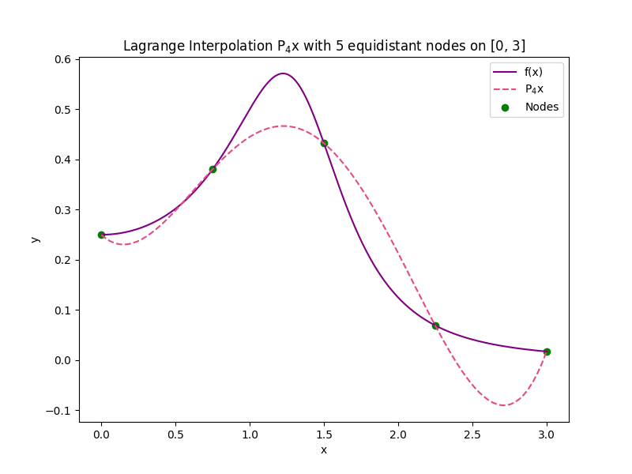
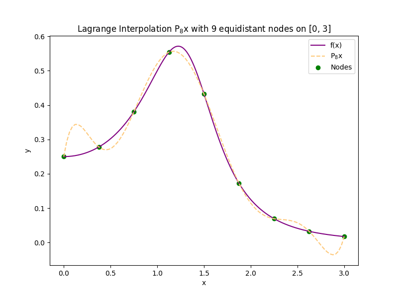
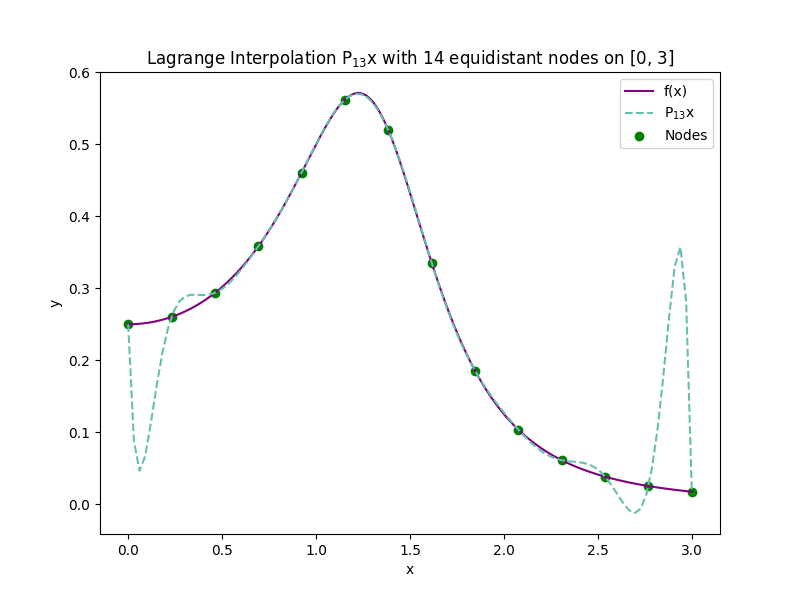
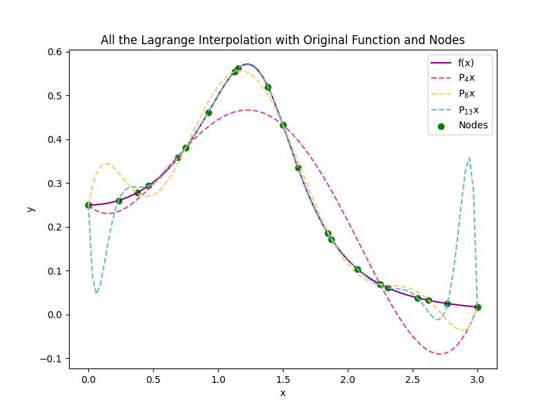

# Numerical Methods Problem Set 4 - CMSC 117

This repository contains the solutions to the Numerical Methods Problem Set 4 (PS4) for CMSC 117 at UP Baguio for the academic year 2024-2025. The problem set includes exercises on Lagrange Polynomial Interpolation (1D and 2D) and Newton-Cotes Quadrature.

---

## Problem Set Breakdown

### 1. **One-Dimensional Lagrange Polynomial Interpolation**

- **Function: `char_lagrange(z, x)`**
  - This function evaluates the Lagrange characteristic polynomials for the interpolation nodes.
  - Returns an \( (n+1) \times (m+1) \) matrix where each element represents a Lagrange characteristic polynomial.

- **Function: `lagrange(z, x, y)`**
  - This function evaluates the Lagrange polynomial at given points \( z = [z_0, \dots, z_m] \), for interpolation nodes \( x = [x_0, \dots, x_n] \) and corresponding function values \( y = [y_0, \dots, y_n] \).
  - Returns an array of the evaluated Lagrange polynomial values.

- **Plotting**
  - The Lagrange polynomial interpolates \( f(x) = \frac{1}{x^4 - 3x^2 + 4} \) over the interval [0, 3].
  - The plot is generated using 5, 9, and 14 equidistant interpolation points.

**File: `ps4item1.py` / `ps4item1.ipynb`**

### 2. **Two-Dimensional Lagrange Polynomial Interpolation**

- **Function: `lagrange2D(zx, zy, x, y, w)`**
  - This function extends the Lagrange polynomial to 2D. It evaluates the polynomial \( P(x, y) \) over a rectangular domain [a, b] × [c, d].
  - It uses the characteristic Lagrange polynomials for both the x and y axes to construct the 2D interpolant.

- **Grid Interpolation**
  - Interpolate data points on a **10×10 grid**.
  - Perform interpolation on a **100×100 dense grid** to visualize the results.

**File: `ps4item2.py` / `ps4item2.ipynb`**

### 3. **Newton-Cotes Quadrature**

- **Function: `NormalNCWeights(n)`**
  - Computes the normalized weights of the Newton-Cotes Quadrature of degree \( n \) using LU factorization.

- **Function: `NCQuad(f, a, b, w)`**
  - Computes the Newton-Cotes quadrature of a function \( f(x) \) over the interval \([a, b]\) using the normalized weights.

- **Function: `CompositeNCQuad(f, a, b, n, m)`**
  - Computes the composite Newton-Cotes quadrature over \( m \) sub-intervals using degree \( n \) precision.
  - Approximates the function over the specified interval with different combinations of \( n \) and \( m \).

**File: `ps4item3.py` / `ps4item3.ipynb`**

---

## How to Use the Code

### Requirements
To run the Python code and Jupyter Notebooks, make sure you have the following libraries installed:

- `numpy`
- `matplotlib` (for plotting)
- `scipy` (for numerical methods)

You can install the required libraries using:

```bash
pip install numpy matplotlib scipy
```

# Running the Code

1. **1D Lagrange Interpolation:**
   - The `ps4item1.py` file contains the implementation of the 1D Lagrange interpolation.
   - You can run the script to see the plots of the Lagrange polynomial for different interpolation points.

2. **2D Lagrange Interpolation:**
   - The `ps4item2.py` file contains the 2D Lagrange interpolation code.
   - It interpolates a 10x10 grid and generates a plot of the interpolation on a 100x100 dense grid.

3. **Newton-Cotes Quadrature:**
   - The `ps4item3.py` file contains the implementation of the Newton-Cotes quadrature.
   - It calculates and approximates integrals using different degrees of precision and sub-intervals.


/repo-root
│
├── ps4item1.py              # 1D Lagrange Polynomial Interpolation
├── ps4item2.py              # 2D Lagrange Polynomial Interpolation
├── ps4item3.py              # Newton-Cotes Quadrature
│
├── ps4item1.ipynb           # Jupyter Notebook for Item 1
├── ps4item2.ipynb           # Jupyter Notebook for Item 2
├── ps4item3.ipynb           # Jupyter Notebook for Item 3
│
└── README.md                # This documentation file
   

## Example Output

- **1D Interpolation Plot:** A series of graphs showing the interpolation of \( f(x) = \frac{1}{x^4 - 3x^2 + 4} \) using 5, 9, and 14 equidistant points, along with the original function. Below are the generated plots:

  - **Lagrange Interpolation (5 Nodes):**  
    
  
  - **Lagrange Interpolation (9 Nodes):**  
    
  
  - **Lagrange Interpolation (14 Nodes):**  
    
  
  - **Combined Lagrange Interpolation (All Nodes):**  
    

- **2D Interpolation Plot:** A plot of the interpolated function values on a 100×100 dense grid.
  
  [2D Interpolation Plot](./3D_scatter_plot_and_color_map_of_100_by_100_grid_points.png)

- **Newton-Cotes Quadrature Results:** A numerical approximation of the integral using different degrees of precision and sub-intervals.